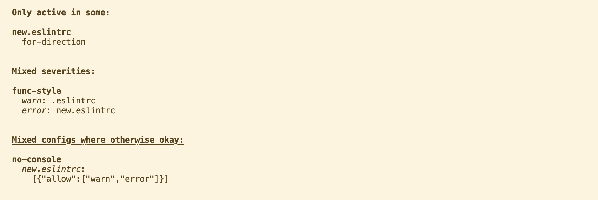

# Compare ESLint configs

[](https://www.npmjs.com/package/compare-eslint-configs)
[](https://www.npmjs.com/package/compare-eslint-configs)
[](https://github.com/voxpelli/eslint-config)
[](https://esmodules.dev/)
[](https://github.com/voxpelli/types-in-js)

## Usage

```bash
npm install -g compare-eslint-configs
compare-eslint-configs .eslintrc new.eslintrc
```

Or simply:

```bash
npx compare-eslint-configs .eslintrc new.eslintrc
```

## Example

### CLI output

```bash
npx compare-eslint-configs new.eslintrc -t cli.js
```



### Markdown output

```bash
npx compare-eslint-configs new.eslintrc -t cli.js -m
```

> # Only active in some:
>
> * **new.eslintrc**
>   * [for-direction](https://eslint.org/docs/rules/for-direction)
>
>
> # Mixed severities:
>
> * [**func-style**](https://eslint.org/docs/rules/func-style)
>   * _warn_: .eslintrc
>   * _error_: new.eslintrc
> * [**unicorn/prefer-event-target**](https://github.com/sindresorhus/eslint-plugin-unicorn/blob/v43.0.2/docs/rules/prefer-event-target.md)
>   * _warn_: .eslintrc
>   * _error_: new.eslintrc
>
>
> # Mixed configs where otherwise okay:
>
> * [**no-console**](https://eslint.org/docs/rules/no-console)
> * _new.eslintrc_:
>   ```json
>   [{"allow":["warn","error"]}]
>   ```

## Syntax

```bash
compare-eslint <eslint config files, separated by spaces>
```

If a single config file is given, then it will be assumed to be compared with `.eslintrc`.

More than two config files can be compafred at once.

### Flags

* `-r` / `--group-rules` – when set the comparison output will group by rules rather than config
* `-t <file>` / `--target-file <file>` – defaults to `index.js` – the file for which the config will be compared. Especially important when there's eg. different configs for `.js` and `.ts` files. Then point this to the one you want to do a comparison on.

## See also

* [`@voxpelli/eslint-formatter-summary`](https://github.com/voxpelli/eslint-formatter-summary) – can summarize errors/warnings by ESLint rule + print that list as markdown
